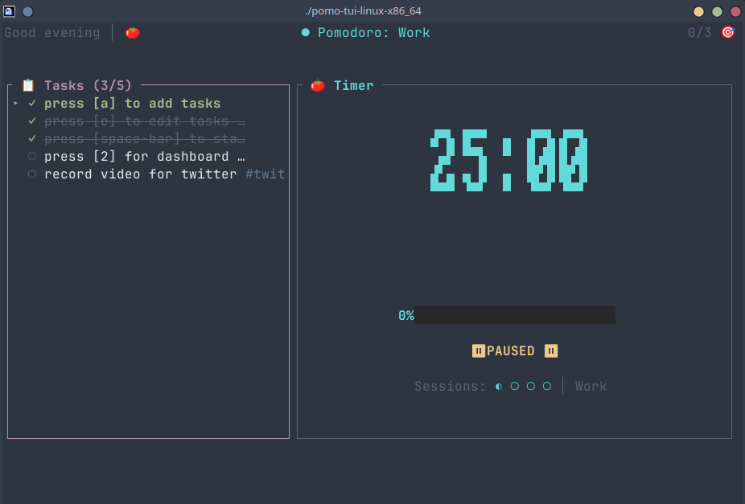

# Pomo TUI 🍅

> **Focus. Flow. Frictionless.**

A beautiful, minimal, and keyboard-driven Pomodoro timer for your terminal. Designed for "Visual Zen" and deep work.



## ✨ Features

- **Visual Zen**: Minimalist UI with massive whitespace and distraction-free design.
- **Frictionless Flow**:
  - `Space` is the master key: Start timer, skip note, start next session.
  - **Inline Notes**: finish a session? Just type what you did and hit Enter (or Space to auto-continue). No annoying popups.
- **Data Driven**: Tracks your sessions, streaks, and tags. Persistence built-in.
- **Keyboard First**: Every action has a snappy Vim-like keybinding.
- **Adaptive**: "Late Night" warnings 🌙 and breathing animations to keep you calm.

## 📦 Installation

### Option 1: Binary Download (Easiest)
Go to the [Releases Page](https://github.com/Mahaprasad003/pomo-tui/releases) and download the file for your OS:
- **Linux**: `pomo-tui-linux-x86_64` (Static binary, run anywhere)
- **Windows**: `pomo-tui-windows-x86_64.exe`
- **macOS**: `pomo-tui-darwin-x86_64` (Intel) or `...-aarch64` (Apple Silicon)

**Linux / macOS:**
Make the file executable and run it:
```bash
chmod +x pomo-tui-linux-x86_64
./pomo-tui-linux-x86_64
```

**Windows:**
Just double-click `pomo-tui-windows-x86_64.exe` or run it from PowerShell:
```powershell
./pomo-tui-windows-x86_64.exe
```

### Option 2: Build from Source (Rustaceans)
If you have `cargo` installed:
```bash
cargo install --path .
# or run directly
cargo run --release
```

## 🎮 Usage & Keybindings

| Key | Action |
| :--- | :--- |
| **Space** | **Start / Pause** (or Auto-skip note) |
| `r` | Reset timer |
| `n` | Skip to next session (Break/Work) |
| `1` / `2` / `3` | Switch views (Timer / Dashboard / Settings) |
| `a` | Add new task |
| `e` | Edit selected task |
| `d` | Delete selected task |
| `c` | Clear completed tasks |
| `/` | Quick capture mode |
| `f` | Toggle Focus Mode (hides everything but timer) |
| `?` | Show help menu |
| `q` | Quit |

## 🛠 Configuration
Configuration is stored in `~/.config/pomo-tui/config.json` (Linux/Mac) or `%APPDATA%\pomo-tui\config.json` (Windows).
You can also change settings directly in the app (Press `3`).

##  License
MIT License. Free to use, hack, and share.
